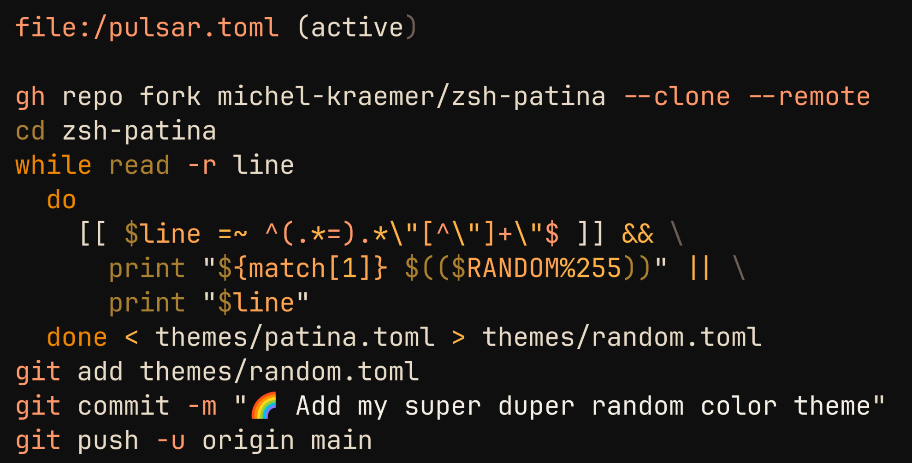

# zsh-patina-pulsar

a zsh-patina theme Pulsar



# Usage

refer to [zsh-patina](https://github.com/michel-kraemer/zsh-patina)

copy [`pulsar.toml`](pulsar.toml) to `~/.config/zsh-patina/pulsar.toml`

Edit/create `~/.config/zsh-patina/config.toml`,

Place `theme = "file:~/.config/zsh-patina/pulsar.toml"` in `[highlighting]` 

e.g.

```toml
[highlighting]

theme = "file:~/.config/zsh-patina/pulsar.toml"
```

# License

MIT

# Support

Add an issue to [/issues](https://github.com/ocodo/zsh-patina-pulsar/issues)
